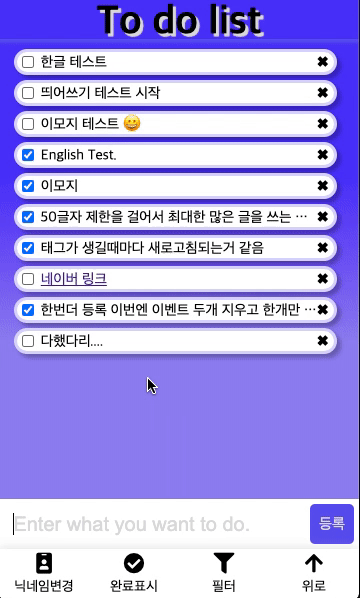

# 📝 To-do-list FE

> 마크업과 순수 자바스크립트로 구현한 To do list 입니다.

-   HTML을 이용하여 웹 브라우저에서 돌아갈 수 있게 했음.
-   모바일 버전으로 만듬.

<br>

## Prerequisites

Make sure you have installed all of the following prerequisites on your development machine:

-   Git - [Download & Install Git](https://git-scm.com/downloads). OSX and Linux machines typically have this already installed.
-   Spring boot - [Spring boot](https://start.spring.io/) create new project
-   Docker - docker hub [install](https://hub.docker.com/?overlay=onboarding)

<br>

## ▶ Run

1. Docker 설치 후 docker-compose 실행

```
    cd ./to-do-list-noti2007
    docker-compose up
```

docker container가 정상적으로 실행되면 로컬에 DB환경 구축 완료 (기존 DB와 port 충돌 조심!!)

아래 경로로 들어가 브라우저를 통해 열어서 실행

```
    ./to-do-list-noti2007/frontend/index.html
```

<br>

## 🔨 사용 기술

-   Js
-   HTML & CSS
-   Ajax

<br>

## 🏞 디자인



<br>

## 기능 정리

-   회원가입에 기능을 집중시키지않고 To do list 자체 기능을 빨리 만드는 것을 목표로함.

### 할일

등록, 삭제, 아이디 별 조회, 완료 상태 숨기기, 필터 값만 보이기

### 유저

닉네임을 넣고 조회시 없으면 새롭게 생성, 기존에 존재하면 불러오기
